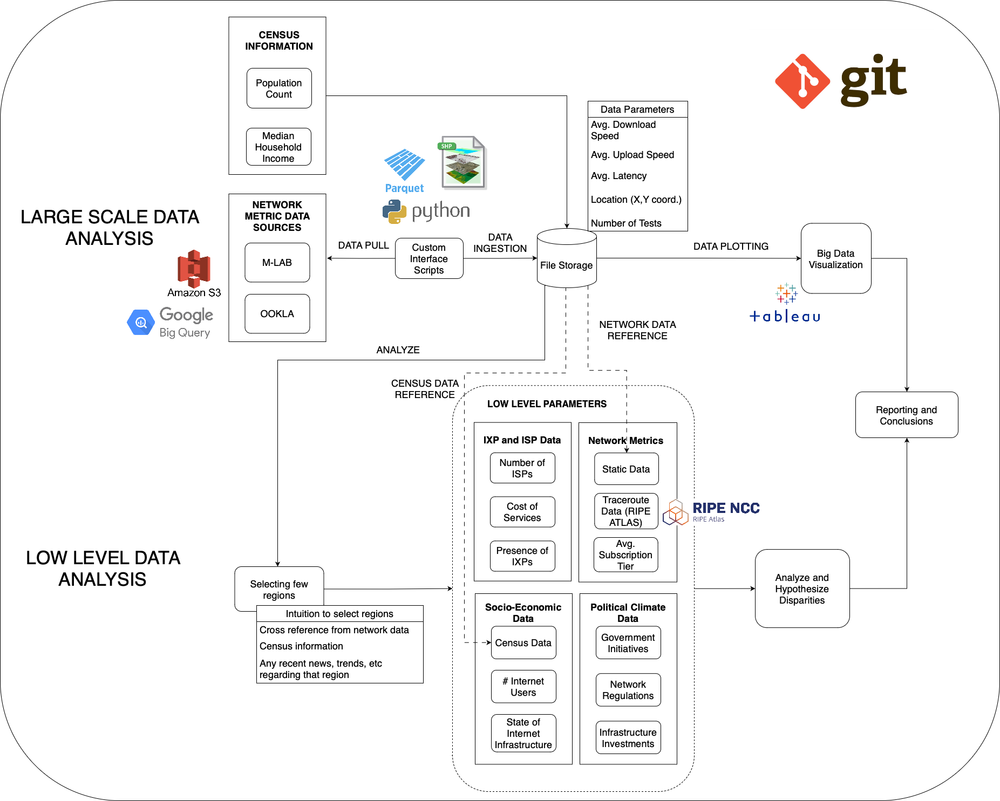

# Internet-Access-Disparities
Project scope - Conduct a large scale analysis of network measurements in USA, Europe and India and low-level analysis for a few select regions to understand if there are Internet Access Disparities among the general population for a given region. Socio-economic, geographic and political climate factors are taking into account when conducting the analysis.

# System Design

Large Scale Data Analysis

1. Data Sources: Our methodology utilizes multiple data sources for network metric data:
- MLAB (Measurement Lab): Provides open-source internet performance data.
- OOKLA: Offers data from speed tests that measure internet connection speeds.
- RIPE Atlas: Maintains a global network of probes that measure internet connectivity
and reachability.

2. Data Pull: Data is extracted from these sources, through a custom interface designed to
query and collect the necessary information from the above stated data sources.

3. Data Ingestion: The collected data may undergo an ingestion process to a data storage
system where it can be processed. Data ingestion will involve:
- Data Correlation: Associating different data points with each other based on common
identifiers.
- Data Cleaning: Removing or correcting erroneous or incomplete data entries.

4. Data Storage: The ingested data is stored in a format and system that facilitates analysis.
We will be storing this on our local file server systems since we will be dealing with large
volumes of data which will amount to nearly 50 GB.

5. Data Plotting: The stored data is then plotted for visualization. This could involve:
- Tableau: For creating interactive data visualizations.
- Python: Using libraries like Matplotlib, seaborn, or Plotly for creating static or interactive
plots.

Low-Level Data Analysis

Note on the selection of specific regions: A few states from the US and all the metropolitan
cities in the following countries/continent: India, Africa, Middle East and SouthEast Asia. This
selection of countries will be refined once we have the large scale dataset ready.

1. Low-Level Parameters: More detailed analysis is performed with a focus on specific
regions, informed by:
- Selection of Few Regions: Targeting specific areas for in-depth analysis.
- Cross-Reference: Using network data, census information, recent news, trends, and
research papers to understand the context of the selected regions.

2. Other Data Sources: Additional data to support the analysis might come from:
- ITU (International Telecommunication Union): Provides standardized global telecom
data.
- IXP Data: Data from internet exchange points from open source IXPs datasets like
CAIDA.

3. Dynamic RIPE Atlas Traceroute Information: Utilizing traceroute data from RIPE Atlas for
real-time path analysis which can provide insight into network performance and topology.

4. Political Climate and Socio-Economic Data: Incorporating contextual data that could
impact internet access and performance, such as:
- Social Media and News: For up-to-date information on the political climate.
- NGO Reports: Reports from Non-Governmental Organizations on regional
developments.
- UN Websites (UNSD): United Nations Statistical Division for global statistical data or
any other relevant UN body
- Census Websites of the Country: For demographic and socio-economic data.

Conclusion and Reporting

After conducting both large-scale and low-level data analysis, the findings are compiled and
synthesized into reports. These reports likely include:
- Analysis and Hypothesis for Disparities: Examining the reasons behind disparities in
internet access and quality among different regions.
- Reporting and Conclusions: Presenting the analysis results, drawing conclusions, and
possibly making policy recommendations.
This methodology is comprehensive, integrating both macro and micro-level data analyzes to
understand internet access disparities and network performance. It leverages a wide array of
tools and data sources to provide a multi-faceted view of internet metrics and contextual
factors. The end goal is to report findings that are well-informed by a variety of qualitative and
quantitative data points.

# IXP Datasets
CAIDA Dataset - https://publicdata.caida.org/datasets/ixps/

File ixs.jsonl contains information about individual IXPs. The "pch_id", "pdb_id", and "pdb_org_id" values match the IXP ids in the original sources, Packet Clearing House (PCH) and PeeringDB (PDB) respectively. Other fields are self-explanatory.

File organizations.jsonl contains the information about each organization learned from PDB. These can be matched with their corresponding facility by matching the facility's pdb_org_id with the organization's pdb_org_id.

File locations.jsonl is similar to the geoname locations, but contains negative "geo_id"s for those locations where geographic locations of IXPs were not found in the geonames dataset.

# Ookla Datasets
TIGER (Topologically Integrated Geographic Encoding and Referencing) shapefiles are a type of digital data produced by the United States Census Bureau. They contain detailed geographic and cartographic information used for mapping and geographic analysis. TIGER shapefiles are an integral part of the infrastructure for mapping and geographic information systems (GIS) in the United States, supporting various applications, including demographics, urban planning, transportation, and more.

# M-LAB dataset
M-LAB hosts it's network data in a custom BigQuery link - https://www.measurementlab.net/data/docs/bq/quickstart/

# Census Data
- USA
U.S. Census Bureau ftp site. - https://www2.census.gov/geo/tiger/TIGER2023/COUNTY/tl_2023_us_county.zip (for 2023)

- EUROPE
The geometries of European territorial units (local administrative units (LAU) and regions/districts (NUTS2/NUTS3)) distributed by Eurostat for EU Member States, EU official candidate countries, and EFTA countries.
Available through the library latlon2map [1]

# Geo spatial
https://gadm.org/data.html

# Things to consider when devising conclusions
Check tiers of ISP when checking for disparities using Reference [3]

# References
- [1] https://github.com/EDJNet/internet_speed - For Europe
- [2] https://dl.acm.org/doi/abs/10.1145/3578338.3593522 - A Comparative Analysis of Ookla Speedtest and Measurement Labs Network Diagnostic Test (NDT7)
- [3] https://ebelding.cs.ucsb.edu/sites/default/files/publications/paul_imc_subscription_tier.pdf - The Importance of Contextualization of Crowdsourced Active Speed Test Measurements
